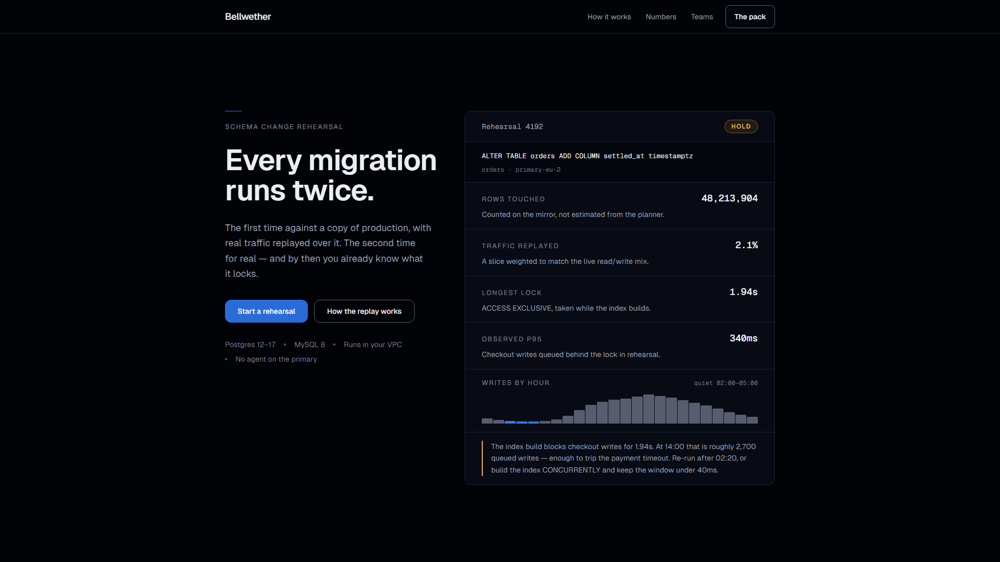
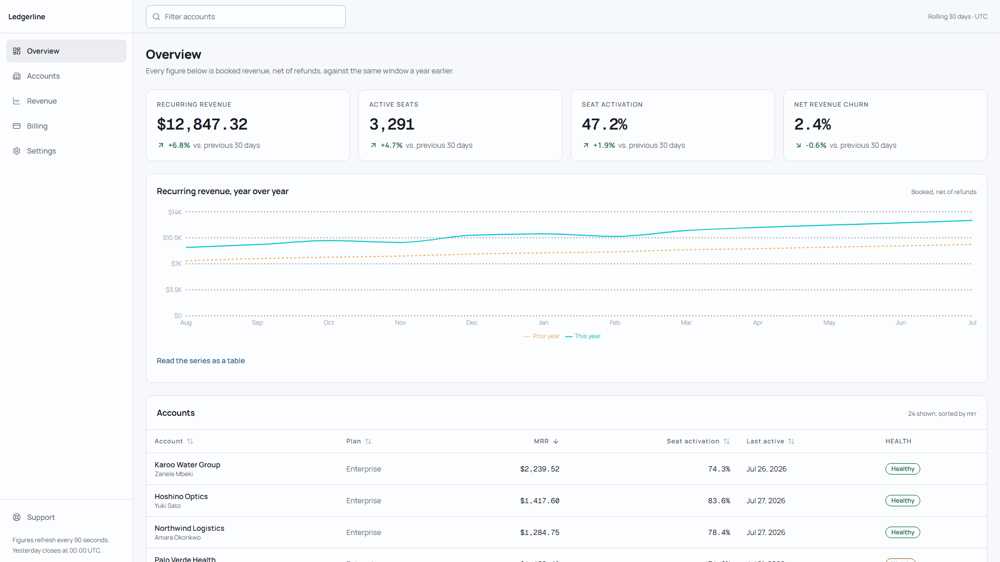
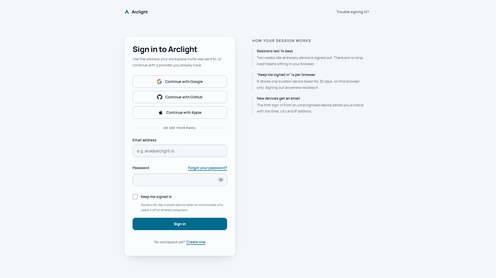
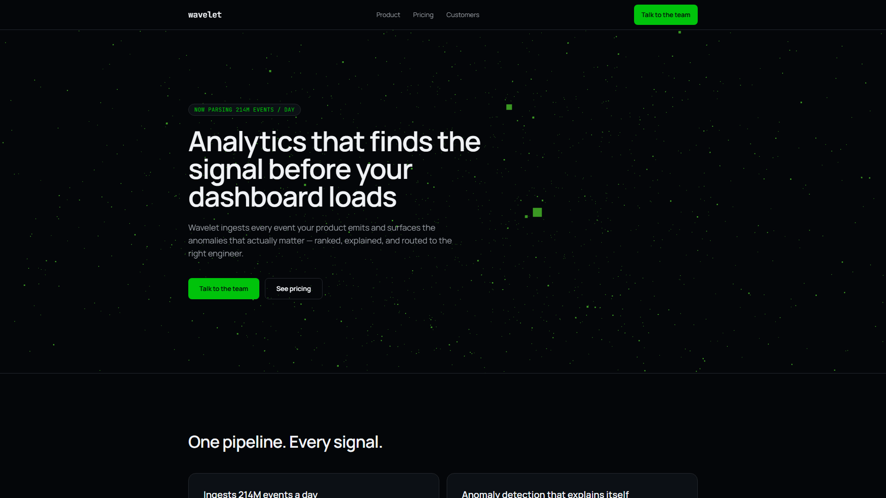

<div align="center">

# frontend-design-pro

**Your AI agent already writes React.**
**This makes it write React that doesn't look AI-generated.**

[](https://github.com/Krishna-Modi12/frontend-design-pro/releases)
[](https://github.com/Krishna-Modi12/frontend-design-pro/actions/workflows/ci.yml)
[](LICENSE)
[](https://github.com/Krishna-Modi12/frontend-design-pro/stargazers)

[](https://krishna-modi12.github.io/frontend-design-pro/)

**[Live demo](https://krishna-modi12.github.io/frontend-design-pro/)** · **[Install](#install-in-30-seconds)** · **[Skills](#the-19-skills)** · **[Architecture](#architecture--registry--lazy-loading)** · **[Demos](#demos)** · **[Verification](#verification)** · **[Docs](#docs)**

</div>

---

A machine-enforced frontend UI/UX skill pack for AI coding agents. Most prompt packs *tell* an agent what good UI looks like. This one proves it: every example compiles under `tsc --strict`, passes AST analysis, and ships with a test — and no archive can be built unless all of that is green.

> [!NOTE]
> **The whole claim is that it is verified rather than asserted.** Every number below is recomputed from the filesystem by a release-blocking gate. When a document and a gate disagree, the gate is right.

<div align="center">

| Skills | References | Depth | Always loaded | Per request | Constraints | Gates |
|:---:|:---:|:---:|:---:|:---:|:---:|:---:|
| **19** | **96** | **337,392 tokens** | **2,088 tokens** | **5,794–7,394** | **59** | **11** |

</div>

---

## Table of contents

- [What actually changes in your output](#what-actually-changes-in-your-output)
- [Install in 30 seconds](#install-in-30-seconds)
- [What this pack does on your machine](#what-this-pack-does-on-your-machine)
- [The 19 skills](#the-19-skills)
- [Architecture — registry + lazy loading](#architecture--registry--lazy-loading)
- [Demos](#demos)
- [The pack, pointed at itself](#the-pack-pointed-at-itself)
- [Release history](#release-history)
- [Verification](#verification)
- [Issues & contributing](#issues--contributing)
- [Docs](#docs)

---

## What actually changes in your output

These are not style preferences. Each row is a check that fails a build, with the constraint ID that enforces it.

| What agents reach for by default | What this pack enforces | Enforced by |
|---|---|---|
| `Inter` / `Poppins` / `DM Sans` as the display face | A face with a point of view, system stack as fallback | `TYP-02` |
| Purple → pink → blue gradient | One accent, derived from the brand | `COL-03` |
| `bg-[#0F1419]`, raw hex everywhere | OKLCH tokens only | `COL-04`, `TOK-01` |
| `min-h-screen` | `min-h-[100dvh]` — the mobile viewport is not the screen | `RES-03` |
| `setTimeout(() => setLoading(false), 1500)` | Loading state driven by real async, never faked | `DELAY-01-AST` |
| `ease-in` on an entrance | Ease-out to arrive, ease-in to leave | `MOTION-02` |
| A `scroll` listener calling `setState` | Re-render per frame is a bug, not a technique | `ANI-04` |
| "John Doe", "$99.99", "Elevate your workflow" | Real-shaped names, organic figures (47.2%, $12,847) | `SLOP-01`, `SLOP-02`, `SLOP-04` |
| `aria-label` mentioned in a comment | Real JSX attributes, or it doesn't count | `A11Y-01` |
| Equal-height card grid, 3 across | Asymmetry, hierarchy, one showpiece per viewport | anti-slop wall |
| A component with only a happy path | All four states — loading, empty, error, success | `STA-01`, `STA-02` |

The full list of 59 lives in [`core/validate-checklist.md`](core/validate-checklist.md). Ten deliberate **anti-examples** (`skills/*/examples/bad-*.tsx`) exist to prove the checks fire — the suite asserts they fail.

---

## Install in 30 seconds

```bash
npx skills add Krishna-Modi12/frontend-design-pro
```

One command, no clone, no setup script. It detects every agent you have installed and wires the pack into each.

It installs as **one** skill, which is the shape this pack needs: the root `SKILL.md` router arrives with `core/` and all 19 `skills/` beside it, so lazy loading still works. Verified against a clean directory — 19 of 19 registry rows and 6 of 6 declared core deps resolve inside the install.

> [!WARNING]
> **Do not pass `--full-depth`.** That flag tells the installer to keep walking subdirectories even when a root `SKILL.md` exists, which installs all twenty skills as peers instead of one router over nineteen. Measured, not assumed:
>
> ```bash
> npx skills add Krishna-Modi12/frontend-design-pro --list               # one entry — the router
> npx skills add Krishna-Modi12/frontend-design-pro --list --full-depth  # the router plus all 19 behind it, as peers
> ```
>
> The default is the one you want. `--full-depth` turns a 2,088-token registry into nineteen skills competing to match your request, which is the architecture this pack exists to avoid.

The installer sends anonymous install telemetry by default; `DISABLE_TELEMETRY=1 npx skills add …` opts out. That is the CLI's behaviour, not the pack's — see [what this pack does on your machine](#what-this-pack-does-on-your-machine).

<details>
<summary><b>Or install from the git tree / the gated archive</b></summary>

Run this from the root of the project you want the agent to work on:

```bash
git clone --depth 1 https://github.com/Krishna-Modi12/frontend-design-pro && bash frontend-design-pro/setup.sh
```

The clone directory is named `frontend-design-pro` on purpose — every adapter references `frontend-design-pro/SKILL.md` relative to your project root, so the path the installer writes is the path that exists. `setup.sh` then detects your agent and writes its native rules file.

**Prefer the gated archive over a git tree?** Every release attaches a `.skill` built only after all 11 gates pass. The tree on `main` is checked by CI, but the archive is the artifact that cannot exist while anything is red.

```bash
gh release download --repo Krishna-Modi12/frontend-design-pro --pattern '*.skill'
unzip frontend-design-pro-v*.skill -d ./   # pack lands at ./frontend-design-pro/
bash frontend-design-pro/setup.sh          # detects the agent, writes its native rules file
```

</details>

**Not sure, or using something not listed? Install the cross-agent file:**

```bash
bash frontend-design-pro/setup.sh agents   # writes AGENTS.md
```

`AGENTS.md` is an open specification governed by the Linux Foundation's Agentic AI Foundation, and roughly thirty agents read it — Codex, Cursor, Copilot, Windsurf, Aider, Continue, **Zed, Jules, Devin, Factory, Amp, OpenHands, JetBrains Junie, Roo Code**. One file, most of the field.

Ten adapters install automatically: `agents` · `cursor` · `copilot` · `cline` · `roo` · `zed` · `gemini` (CLI) · `windsurf` · `continue` · `aider`. Four are manual because no installer should write them — Claude Code (a user-level skills directory), ChatGPT (a web upload), Codex (an `AGENTS.md` your repo already owns), and anything unlisted.

`setup.sh --list` names every adapter, `setup.sh cursor` skips detection, `--dry-run` shows what it would write, and nothing is overwritten without `--force`. `setup.ps1` is the PowerShell port. The files it copies live in [`install/`](install/) if you would rather place them yourself.

### What this pack does on your machine

You are about to let an agent load this into a repository that probably has secrets in it, and `npx skills add` means most people will never see the tree first. So, plainly:

- **It is markdown and TypeScript files.** Nothing in the pack runs. The agent *reads* it; the `.tsx` examples are read too, not executed — no build step, no postinstall, no bundled binary.
- **It makes no network calls and collects no telemetry.** No analytics endpoint, no beacon, no phone-home. Two example files call `fetch()`, and both are demonstrating a real loading state in code you would copy — they run only if you run them.
- **The only thing that executes is `setup.sh` / `setup.ps1`**, which you can read in full. Between them they invoke `basename`, `cp`, `dirname`, `find`, `mkdir` and `printf`. No `eval`, no `curl`, no `sudo`, no elevation.
- **It needs no credentials, keys or environment variables**, and reads none.
- **It writes only adapter rules files** into your project, all listed by `setup.sh --dry-run` before anything is written, and never overwrites without `--force`.

Verify rather than trust it — these are the checks, not a summary of them:

```bash
grep -nE 'curl|wget|eval|exec|sudo|base64' setup.sh setup.ps1        # expect: no matches
grep -rlE 'sendBeacon|XMLHttpRequest|axios|new WebSocket' skills/     # expect: no matches
bash setup.sh --dry-run                                              # every path it would write
```

The one caveat is the installer, not the pack: `npx skills` sends anonymous install telemetry by default. `DISABLE_TELEMETRY=1` turns it off, and the git-clone and archive routes above never involve it at all.

Then just ask for what you want, in plain language:

```
Build a pricing section for a developer tool. Dark mode, three tiers,
annual/monthly toggle. Not the usual three equal cards.
```

The agent matches your wording against the registry, loads **one** skill plus its dependencies, and builds. **No slash commands, no prefixes** — routing is on natural-language trigger keywords.

<details>
<summary><b>Per-host setup — the exact path for each of the manual hosts</b></summary>

<br>

The remaining hosts need a web UI or a merge into a file your repo owns, so they stay manual. Every row is the real setup path, not an approximation.

| Agent | Steps |
|---|---|
| **[Claude Code](docs/CLAUDE_SETUP.md)** | 1. Unzip the `.skill` into `~/.claude/skills/` (or project-scoped `.claude/skills/`) <br> 2. Start a new session — no system prompt needed <br> 3. Ask in plain language: *"Create a landing page for a developer tool"* |
| **[Claude Desktop](docs/CLAUDE_SETUP.md)** | 1. Unzip the `.skill` somewhere stable <br> 2. New Project → paste `AGENT_SYSTEM_PROMPT.md` into Project Instructions <br> 3. Upload the unzipped folder to Knowledge <br> ⚠️ No filesystem — retrieval-based, lazy loading degrades |
| **[Cursor](docs/CURSOR_SETUP.md)** | 1. Unzip into the workspace <br> 2. Create `.cursor/rules/*.mdc` with the routing instructions (legacy: `.cursorrules`) <br> 3. `@`-reference `SKILL.md` the first time in Chat/Composer <br> ⚠️ May paraphrase a reference instead of reading it — `@`-reference the specific file if output drifts generic |
| **[ChatGPT Custom GPT](docs/CHATGPT_SETUP.md)** | 1. Create a Custom GPT <br> 2. Upload `SKILL.md` + the `core/*.md` files a typical request needs + 2–3 relevant skill routers <br> 3. Paste routing instructions into Instructions <br> ⚠️ 20-file knowledge cap total — curate a subset, retrieval search not lazy loading |
| **[OpenAI API](docs/OPENAI_API_SETUP.md)** | 1. Put `SKILL.md` (+ known-relevant skill/core files) in the system message for a narrow integration <br> 2. Or build a function-calling loop that fetches pack files by path for real per-request loading <br> ⚠️ No built-in gate-script awareness — wire it in yourself if enforcement matters |
| **[GitHub Copilot](docs/COPILOT_SETUP.md)** | 1. Unzip into the repo <br> 2. Create `.github/copilot-instructions.md` with a *short* routing instruction (not the full `AGENT_SYSTEM_PROMPT.md`) <br> 3. Optional: path-scoped `.github/instructions/*.instructions.md` with `applyTo` <br> ⚠️ Always-loaded in full, not fetch-on-demand — the 96 references are out of reach unless pasted by hand |
| **[Gemini](docs/GEMINI_SETUP.md)** | 1. Put `SKILL.md` in the system instruction (add `core/*.md` + skill routers too for a broad integration — the large context window absorbs it) <br> 2. For true on-demand loading, wire function-calling to fetch pack files by path <br> ⚠️ Static context by default, not lazy loading — a big window makes the cost affordable, not free |

**Don't see your agent?** [`install/`](install/) adds adapters for Windsurf, Continue.dev, Aider and OpenAI Codex CLI — untested against the matrix, but following each host's documented rules format. [docs/AGENT_COMPATIBILITY.md](docs/AGENT_COMPATIBILITY.md) has the full matrix; [docs/INSTALL.md](docs/INSTALL.md) covers generic setup.

</details>

`SKILL.md` is self-contained, so no system-prompt setup is required. If your host supports a system prompt, [`AGENT_SYSTEM_PROMPT.md`](AGENT_SYSTEM_PROMPT.md) is a registry-native drop-in that makes the loading protocol and the validation contract explicit. Full guide: [docs/USAGE.md](docs/USAGE.md).

---

## The 19 skills

One skill loads per request. You never name it — the **Try saying** column is what actually routes there. Most specific wins: *"form validation"* goes to `forms`, not `react-components`.

### Building something new

| Skill | What it covers | Try saying |
|---|---|---|
| [`landing-pages`](skills/landing-pages/SKILL.md) | Heroes, pricing, testimonials, bento grids, logo walls, comparison tables, FAQ, CTAs, footers — plus empty states and onboarding | *"Build a landing page for a CI tool. Dark, technical, no stock-photo energy."* |
| [`react-components`](skills/react-components/SKILL.md) | One reusable component or a small family: button, card, modal, dropdown, tabs, accordion, tooltip, select, popover. shadcn/Radix, compound components, `forwardRef`, CVA | *"Build a Dialog with a compound API — Dialog.Root, Trigger, Content — that traps focus properly."* |
| [`forms`](skills/forms/SKILL.md) | Anything collecting input: contact, checkout, login, signup, password reset, OTP/MFA, multi-step wizards, settings. React Hook Form + Zod, Stripe PaymentElement | *"Multi-step checkout with Zod validation and errors wired to aria-describedby."* |
| [`data-tables`](skills/data-tables/SKILL.md) | Tabular and data-dense UI: sorting, filtering, pagination, row selection, KPI cards, charts, analytics dashboards, admin panels. TanStack Table/Query | *"Sortable, filterable users table with pagination and a loading skeleton."* |
| [`threejs-3d`](skills/threejs-3d/SKILL.md) | Browser 3D: scenes, GLTF/GLB models, shaders, post-processing, orbit controls, raycasting, Spline embeds, particle systems, 3D heroes | *"A subtle WebGL particle hero that doesn't tank LCP or run under reduced motion."* |

### Making it look right

| Skill | What it covers | Try saying |
|---|---|---|
| [`design-system`](skills/design-system/SKILL.md) | Design tokens, OKLCH palettes, typography and spacing scales, theming, dark mode, brand systems, font pairing, Figma handoff | *"Build me a token system from this brand colour, with a dark mode that isn't just inverted."* |
| [`design-principles`](skills/design-principles/SKILL.md) | The *why*: visual hierarchy, Gestalt grouping, Fitts/Hick/Miller, cognitive load, choice architecture, perceived performance, design-DNA extraction | *"Critique this layout. Why does it feel cluttered, and what's the actual fix?"* |
| [`design-research`](skills/design-research/SKILL.md) | Live web research — browse Dribbble, Mobbin, Aceternity, Motion.dev, React Bits, 21st.dev, extract palettes and easing curves, convert them to typed constraints **before** any code | *"Build a hero inspired by this Dribbble shot: &lt;url&gt; — dark, developer tool."* |
| [`animations`](skills/animations/SKILL.md) | Entrance/exit transitions, micro-interactions, hover states, scroll-driven sequences, parallax, route transitions, shared-element morphs, stagger, reduced motion | *"Add a staggered reveal to these cards — subtle, and respect prefers-reduced-motion."* |
| [`component-patterns`](skills/component-patterns/SKILL.md) | Patterns from third-party libraries — animated text, magnetic/tilt/spotlight effects, ambient canvas backgrounds, carousels, docks, bento — with the a11y and perf rules they omit | *"Give me an animated headline like Aceternity's, but keyboard-accessible."* |
| [`iconography`](skills/iconography/SKILL.md) | Icon sizing, weight matching, colour inheritance, hit areas, SVG accessibility, avatars and initials, empty-state illustration | *"These icons look off next to the text — fix the sizing and optical alignment."* |
| [`canvas-typography`](skills/canvas-typography/SKILL.md) | Type rendered as a system: particle text, kinetic type, variable-font axis animation, scramble/decode reveals, text on a path — with the real string always left in the DOM | *"A hero headline that assembles from particles on mouse-over, and still reads fine with JS off."* |
| [`color-themes`](skills/color-themes/SKILL.md) | Colour computed rather than chosen: OKLCH token generation from one hue, harmonic schemes, palettes extracted from an image, light/dark/auto architecture, contrast measured before a token ships | *"Generate a full dark theme from this brand blue, and prove the text passes AA."* |

### Making it work well

| Skill | What it covers | Try saying |
|---|---|---|
| [`react-performance`](skills/react-performance/SKILL.md) | Request waterfalls, bundle size, RSC boundaries, memoization, re-renders, long lists, lazy loading, prefetching, Core Web Vitals | *"This page has a 4s LCP. Find the waterfall and fix it."* |
| [`web-interface`](skills/web-interface/SKILL.md) | Auditing and polishing what already exists — design review, a11y audit, copy review, typography and contrast passes, touch targets, safe areas | *"Review this component. What's wrong with it that I'm not seeing?"* |
| [`testing`](skills/testing/SKILL.md) | Vitest, Testing Library, jest-axe accessibility assertions, Playwright e2e, Storybook stories, mock policy | *"Write tests for this form — including the validation errors and an axe pass."* |
| [`platform`](skills/platform/SKILL.md) | Platform surfaces rather than generic components: mobile/PWA, React Native/Expo, i18n and RTL, SEO/metadata, Stripe, transactional email, AI chat and streaming UI | *"Make this work as a PWA with proper safe-area handling on iOS."* |

### Meta

| Skill | What it covers | Try saying |
|---|---|---|
| [`ai-ui-generation`](skills/ai-ui-generation/SKILL.md) | Prompt-to-UI, JSON/schema-driven rendering, server-driven UI, component registries, and the guardrails generated markup must pass before it ships | *"Render components from this JSON schema, and validate before it hits the DOM."* |
| [`agent-ops`](skills/agent-ops/SKILL.md) | The agent's own process: token budgeting, cross-session memory, self-verification loops, parallel work, subagent orchestration | *"You keep re-reading the same files. Set up a context budget."* |

> [!IMPORTANT]
> **No keyword match?** The agent asks one clarifying question rather than guessing — that behaviour is part of the contract, not a fallback.

---

## Architecture — registry + lazy loading

The pack is not a document. It is a **registry that routes**: a monolithic 330k-token pack could not be loaded at all.

| Layer | What it is | Cost |
|---|---|---|
| `SKILL.md` | Registry, routing table, anti-slop wall | **2,088 tokens** — always loaded |
| `core/` | Shared primitives (tokens, a11y, component API, behaviour, checklist, intake) | 2,843–3,747 tokens — the deps one skill declares |
| `skills/{id}/SKILL.md` | One skill file | 843–1,674 tokens — one per request |
| `skills/{id}/references/` | Deep material | **337,392 tokens** — loaded only when a skill points at it |

**A typical request loads 5,794–7,394 tokens, not 337,392.** Adding a skill costs about 51 tokens of always-loaded context. The two skills in v14.5.0 took the registry from 1,895 to 1,998 — 103 tokens for both, which is the clearest confirmation of that figure the project has: it was derived from a single skill and held exactly when two were added at once. Their 8 new reference files added 65,000 tokens of depth, none of it loaded unless a request routes there. Gate 8a fails the build if any skill exceeds 3,000 tokens alone or 8,000 with dependencies, so this cannot silently regress.

<details>
<summary><b>The 8 core files, and when each one loads</b></summary>

<br>

Every skill inherits `accessibility-baseline` and `validate-checklist` whenever it produces code; the rest load only when a skill declares them.

| File | Purpose |
|---|---|
| `core/design-tokens.md` | OKLCH tokens, 4pt spacing, typography, canvas rules |
| `core/accessibility-baseline.md` | WCAG 2.2 AA floor — structure, keyboard, focus, contrast, states |
| `core/component-api.md` | Prop taxonomy, forwardRef, CVA, controlled/uncontrolled |
| `core/component-api-deep.md` | Compound components, composition patterns, API anti-patterns |
| `core/agent-behavior.md` | The four principles — think, simplify, stay surgical, verify |
| `core/agent-behavior-patterns.md` | Design-work addendum, external behavioural patterns |
| `core/validate-checklist.md` | All 59 constraints (17 parser + 42 regex, unique IDs) with pass criteria |
| `core/user-intake.md` | Six questions to ask before building a site — and when not to ask them |

</details>

---

## Demos

Four projects generated by the skill routing itself — the pack eating its own cooking. Copy the prompt for any of them from [docs/DEMO_PROMPTS.md](docs/DEMO_PROMPTS.md) and try it yourself.

| Demo | Type | Route taken | What it demonstrates |
|---|---|---|---|
| [`demo/landing-page/`](demo/landing-page/) | **Runnable Next.js app** | `landing-pages` + `core/design-tokens.md` | Dark-mode SaaS page for a fictional product — editorial 7:5 hero over a terminal panel, tabular-nums metric strip, asymmetric bento, testimonials |
| [`demo/dashboard/`](demo/dashboard/) | Stub-typed | `data-tables` + `react-performance` + `core/component-api.md` | Sortable table with all four states, `next/dynamic` chart, `content-visibility` |
| [`demo/auth-form/`](demo/auth-form/) | Stub-typed | `forms` + `core/component-api.md` | RHF + Zod, `aria-describedby` errors, OAuth, jest-axe test |
| [`demo/showcase/`](demo/showcase/) | **Runnable Next.js app** | `landing-pages` + `threejs-3d` + `forms` | R3F hero, bento grid, pricing, testimonials, validated form |

The two stub-typed demos are checked by the same suites as the gold examples — `tsc --noEmit` strict, 17 AST constraints, 42 regex constraints:

```bash
bash demo/validate.sh              # every demo it covers
bash demo/validate.sh dashboard    # one
```

Those read source. Nothing in the gate chain starts a browser, so the demos are also rendered — dev and production, both colour schemes — and checked for uncaught errors, hydration mismatches, axe WCAG 2.1 AA violations and horizontal overflow at 390/768/1920:

```bash
npm run demos:verify
```

> [!WARNING]
> That check exists because it found four defects a green 9/9 chain had passed: a stylesheet that silently did nothing, a page that scrolled sideways on a phone, a `<dl>` with a stray `<p>` in it, and a chart hidden from screen readers but still in the tab order.

If you lift `demo/landing-page/` into a project, take [`tokens.css`](demo/landing-page/tokens.css) with it and import it after Tailwind — its palette is addressed through named utilities (`bg-surface-page`, `text-ink-muted`), and Tailwind only emits those for tokens registered at build time. `dashboard` and `auth-form` carry their own tokens at runtime and need nothing.

Demos are proof, not doctrine. Where a demo and a skill rule disagree, **the rule wins and the demo is the bug.**

### What they look like

Rendered in a real browser rather than described. Each is above-the-fold at 1920×1080; the full pages are linked underneath. Capture spec and how to reproduce these exactly: [`.github/SCREENSHOT_CONTRIBUTION.md`](.github/SCREENSHOT_CONTRIBUTION.md).

**[`demo/landing-page/`](demo/landing-page/)** — a launch page for "Switchyard", a fictional release-orchestration product. Near-black OKLCH surface at a single hue, one acid-green accent, Geist display face, tabular-nums metric strip. **[Open it live →](https://krishna-modi12.github.io/frontend-design-pro/landing-page/)**



*[Full page](demo/landing-page/screenshot-full.png) — the asymmetric feature bento, the metric strip, and the testimonials.*

**[`demo/dashboard/`](demo/dashboard/)** — sortable accounts table, `next/dynamic` revenue chart, tabular-nums KPI cards, light surface.



*[Full page](demo/dashboard/screenshot-full.png) — the table's sort, filter, empty and error states.*

**[`demo/auth-form/`](demo/auth-form/)** — React Hook Form + Zod, OAuth providers, show-password toggle, errors wired through `aria-describedby`.



*[Full page](demo/auth-form/screenshot-full.png).*

**Switchyard does not exist**, and the page says so on itself rather than only in a source comment. It is sample output — the same arrangement as `showcase`'s "Nexus" — so the quotes on it are invented and the operating figures are demo content. It serves those from its own `/api/site/overview`, reading [`screenshot-fixture.json`](demo/landing-page/screenshot-fixture.json), which is committed so the capture is deterministic and a recapture only moves pixels when the UI actually changed. The endpoint is real, which is the point: the metric strip has genuine loading, error and empty branches instead of three that were never exercised.

**The prompt that generates it**, collected with the other three in [docs/DEMO_PROMPTS.md](docs/DEMO_PROMPTS.md):

> Create a dark-mode SaaS landing page with asymmetric bento features, a metric strip with tabular numerics, and social proof. Near-black background, acid-green accent, Geist font. No equal-card grids. No Inter.

Nothing on the page states a figure about this pack. An earlier version did, two of those figures drifted, and it shipped a screenshot reading "Six of 53" against a real count of 59 — in the image this README links. A demo for a fictional product has nothing to keep in step.

```bash
cd demo/landing-page
npm install
npm run dev   # http://localhost:3000
```

### See it in action

> [!TIP]
> **[Open the live showcase →](https://krishna-modi12.github.io/frontend-design-pro/)** — no install, no clone.
> Redeployed from `main` whenever either runnable demo changes; the other one is at **[/landing-page/](https://krishna-modi12.github.io/frontend-design-pro/landing-page/)**. What you see is the output of the routing described below, not a mock-up of it.

[`demo/showcase/`](demo/showcase/) is one of two projects in `demo/` that break the stub-typed convention above on purpose — the other is [`landing-page/`](demo/landing-page/). It is a real, standalone Next.js 15 + React 19 + Tailwind v4 app — its own `package.json`, real installed dependencies (React Three Fiber + drei, React Hook Form + Zod), a dev server that actually boots. It's a cinematic dark-mode landing page for a fictional AI analytics product, "Nexus" — near-black OKLCH surface, single acid-green accent, an asymmetric bento grid, a WebGL particle hero, and a validated contact form.

```bash
cd demo/showcase
npm install
npm run dev   # http://localhost:3000
```

The exact prompt that generates it is documented in [`demo/showcase/README.md`](demo/showcase/README.md#the-prompt-that-would-generate-this) (also collected with the other three in [docs/DEMO_PROMPTS.md](docs/DEMO_PROMPTS.md)) — copy it into any agent set up per the docs above and compare the output.

**The route it takes.** The registry matches *WebGL*, *bento*, *pricing*, *form* and *carousel* against the trigger-keyword column and loads `landing-pages`, `threejs-3d` and `forms` in turn, each pulling `core/design-tokens.md` and `core/component-api.md` from its declared `core-deps`, plus the two universal deps (`core/accessibility-baseline.md`, `core/validate-checklist.md`). Nothing else is read. The bans in the prompt — no Inter, no purple gradient, no `min-h-screen`, no equal-weight card grid — are not politeness: they are the anti-slop wall restated, and the constraint suite fails the build if the output violates them.

**It is checked, not just shipped.** Unlike the two stub-typed demos above, the showcase has real dependencies, so it gets a real check: Gate 9 runs `next build` against the actual vendor typings, and CI installs its dependencies on a clean runner to do the same. It is held to the same content rules as everything else — the 17 AST checks on every authored file, the 42 regex checks on the project. A "runnable demo" that nobody runs is a claim with a shelf life.



Above-the-fold, default viewport, reduced motion off, captured via a headless Chromium driving the real dev server — not staged, not retouched. If a future change to `demo/showcase` makes this stale, [`.github/SCREENSHOT_CONTRIBUTION.md`](.github/SCREENSHOT_CONTRIBUTION.md) has the exact recapture spec.

---

## The pack, pointed at itself

[**`docs/audit-report.html`**](docs/audit-report.html) — open it in a browser — is a hardening audit of this repository, built by giving the pack the same brief you would give it for a client. It is the honest test: a pack that claims to stop AI-looking output should be able to produce a page that does not look AI-generated, about its own defects, without exemptions.

<details>
<summary><b>The exact prompt, and what the brief refuses</b></summary>

<br>

```
Build a single-page audit report for a developer tool that publishes
machine-checked quality claims. It has to communicate three things in order:
two security defects found in shipped reference material, three rules the
product documented everywhere and enforced nowhere, and a gate that was
missing entirely.

Treat it as a test report, not a landing page. No hero. The reader is
deciding whether to trust the tool, so findings and their IDs are the
content — surface severity in form as well as words. Light and dark both.

Constraints: this is our own repo, so obey our own wall. No near-black with
one acid accent, no cream-and-serif, no purple gradients, no Inter. Semantic
colour for severity must be separate from the brand accent. Tabular figures.
No horizontal scroll at 390px.
```

**The route it takes.** *Report*, *severity*, *dark* and *contrast* match the trigger-keyword column, so the registry loads `design-principles` for the information hierarchy, `design-system` for the OKLCH token pair, and `web-interface` for the copy rules — each pulling `core/design-tokens.md`, plus the two universal deps. Roughly 5,900 tokens against 337,392 available.

**What the brief refuses is the interesting part.** "Near-black with one acid accent" is a look this pack has shipped before, and it is on the anti-slop wall as one of the three AI-design defaults. Naming it in the prompt is how you find out whether the pack follows its own rule when the easy answer is right there. The report is ledger rows on cool paper, with a severity stripe carrying state — the accent is structural, and red and amber mean *finding*, not *decoration*.

</details>

---

## Release history

## What's new in v14.8.1

**The archive told people to read files it did not contain.** 22 shipped files carried 137 references to `docs/*.md`, and the archive had no `docs/` directory at all — including all 14 per-agent setup guides and the last line `setup.sh` prints, on the gated-archive route this README recommends.

It had been broken for the pack's entire life, and was found by doing the thing nobody had done in fourteen days and eleven releases: downloading a published release into a clean directory and following its own instructions.

The 13 consumer-facing docs now ship inside the archive (~89 KB — split by audience, not size: you need your host's setup guide, not our freeze policy). `docs/CHANGELOG.md` repoints to `_meta/CHANGELOG.md`, where it actually ships. Anything still unshippable becomes an absolute URL **pinned to its tag** rather than `main` — an archive is a snapshot, and pointing a v14.x reader at today's `main` is how a document starts lying.

Stage 6 now asserts that every `docs/` path cited by a shipped file resolves inside the archive, using the same link shapes and exclusions as the rewriter, so the check and the fix cannot disagree.

<details>
<summary><b>Earlier releases — v14.8.0 back to v14.5.0</b></summary>

<br>

## Previously — v14.8.0

**Gate 11 — the figure gate.** `CLAUDE.md` named the same defect as this repo's worst for several releases: *"No gate validates prose. Counts and token figures are hardcoded across ~30 documents and go stale silently."* Every gate read code. The thing that kept breaking was arithmetic in markdown.

[`scripts/check_figures.py`](scripts/check_figures.py) recomputes every figure from the filesystem — never from `metadata.json`, which it audits instead — and fails the build on any document that disagrees. Figures are matched by **shape and context**, not against a list of known-stale literals, so it catches the *next* drift rather than only this one. It also checks that stated deltas subtract correctly, which is the shape a partial sweep leaves behind: an endpoint updated, a delta not.

**First run: 64 drifts.**

<!-- figures:historical — this list names the superseded figures in order to record that they were wrong; rewriting them to today's values would delete the correction -->

- **The per-request band was wrong in 17 live files**, two of them shipped inside the archive — `AGENT_SYSTEM_PROMPT.md` told an agent its own budget was 5,511–7,112 when it was **5,665–7,266**. A second, rounder band (5,000–6,300) circulated in five more files, including this project's own homepage, already disagreeing with the first before either went stale.
- **`ARCHITECTURE.md`'s per-skill budget table was wrong in all 19 rows — and had been hand-re-derived twice in the preceding release**, by commits whose messages read *"re-derive every figure"*. It was stale again the moment that release shipped. That is the argument for the gate rather than a footnote to it: the manual process was performed correctly, twice, and still produced a wrong table.
- **Three documents claimed two skills grew the registry by 103 tokens** between endpoints that subtract to 107 and 123. A blanket substitution had moved the endpoints and left the deltas; only `docs/CHANGELOG.md` kept the self-consistent original, because `CLAUDE.md` forbids rewriting it.
- **"Nine named gates" sat above a ten-row table.** Gates 2 and 8 reported 17/17 for 19 skills, gate 5 reported 39/39 for 45 golds, path integrity claimed 87 cited references against 95, and `audit-report.html` still said 56 constraints.
- **v14.7.4 shipped with no `metadata.json` changelog entry at all** — caught by the fourth check on a release less than a day old, and restored here.

<!-- /figures:historical -->

Exemptions carry a written reason, per file and per figure. Historical records — `docs/CHANGELOG.md`, `docs/RELEASE_NOTES-*` — are exempt wholesale: they were accurate when cut, and a gate demanding they match today's figures would be demanding the record be falsified. What it still cannot see: figures spelled as words, and documents outside its scan list.

Gates 10 → **11**.

## Previously — v14.7.4

Two taste defects, both found by diffing our references against external sources rather than by reading our own pack. Both are the same shape: **a rule stated in prose, and code breaking it in the same skill.**

- **The reduced-motion snippet was the harmful form.** Two references prescribed `* { animation: none !important }`. That does not shorten the animation, it removes it — so `animationend` and `transitionend` **never fire**, and any component gating unmount or cleanup on those events hangs forever, for exactly the users who asked for less motion. The near-zero-duration form removes the motion and still fires the event. It was also an internal contradiction: `motion-direction.md` says *"replace movement with opacity, or nothing"*, and `scroll-experience.md` already did it correctly.
- **`h-screen` was banned in prose three times and shipped in code five.** `RES-03` keys on the literal `min-h-screen`, so a bare `h-screen` matched nothing — the same blind spot Gate 10 was built for, one token narrower. All five sites are definite-height containers, so `min-h-[100dvh]` would have broken them; they take `h-[100dvh]`, and `h-[100svh]` where the container is scroll-driven and `dvh` would reflow mid-scroll.
- **Seven further findings are published unfixed** in [`docs/RELEASE_NOTES-v14.7.4.md`](docs/RELEASE_NOTES-v14.7.4.md) — including one that would invalidate ~40 of our own snippets if true, and which stays marked unverified until it is benchmarked. A pack claiming *verified rather than asserted* does not get to adopt a competitor's performance claim on authority.

<!-- figures:historical — the figures v14.7.4 corrected; depth has moved since and rewriting this would falsify what that release actually did -->
Three published figures were also wrong, two of them before this release: reference depth is **333,969**, a request costs **5,665–7,266** tokens, and the registry is **2,018** — quoted as both 2,002 and 2,018 in the same documents.
<!-- /figures:historical -->

## Previously — v14.7.3

A review pass, not a feature pass — everything here was found by judging what already shipped.

- **`web-interface` has a gold example for the first time.** It shipped three anti-examples and nothing positive, so *"make this feel more finished"* — the one request it exists to answer — had no worked answer anywhere in the pack. Gate 8b globs `examples/*.tsx`, which counts `bad-*.tsx`, so *every skill has an example* was enforced and *every skill has a **gold*** was not. `good-audited-panel.tsx` is the craft pass at component scale: layered shadows, hover states that **gain** contrast, `tabular-nums`, the `min-w-0` + `truncate` pair, `Intl` formatting, `translate="no"` on identifiers.
- **An entrance eased the wrong way, in code no gate can read.** `good-view-transitions.tsx` ships its CSS in a *"Required CSS (add to global.css)"* comment for the reader to paste, and one `::view-transition-new` rule used `ease-in`. Gate 10 closed the blind spot on references; this is the same blind spot one layer down — **the suites check the code an example runs, never the code it tells you to copy**, because a comment is not TypeScript.
- **The default avatar palette broke ban 3.** Three of the eight prescribed gradients in `icons-avatars.md` were violet→indigo, fuchsia→pink and indigo→purple. A default palette is the worst place to break a ban: every avatar in the product inherits it.
- **The no-raw-hex rule named none of its three real exceptions** — brand assets, React Native `StyleSheet`, three.js materials, none of which parse `oklch()`. Following it literally ships a subtly wrong Google logo. Now named on the wall, with the reason at each site.
- **Two documents contradicted themselves.** `AGENT_SYSTEM_PROMPT.md` gave three different constraint counts within four lines; `ARCHITECTURE.md` disagreed with this file about the test figure, and its per-skill budget table was stale in all 19 rows. Neither is on any sweep list, and no gate reads prose.

New: [`docs/REVIEW_PROTOCOL.md`](docs/REVIEW_PROTOCOL.md) — the spot check, what the gates cannot see, and the severity ladder.

## Previously — v14.7.1

**A correction, published because the alternative is a pack that asserts.**

v14.7.0 described its three new constraints as covering "defects the field ships and nobody checks", and said no competing pack enforced any of them. That was asserted, not verified — the exact failure mode this project exists to make impossible. So it was checked against source.

| Constraint | Enforced elsewhere? |
|---|---|
| `A11Y-06` — `outline-none` with no indicator | **No.** Zero matches for `outline` across impeccable's 46 detector rules. ui-ux-pro-max carries "Focus states visible for keyboard nav" as a self-graded checklist line with no machine check behind it |
| `TYP-03` — gradient text on body copy | **Yes — the claim was wrong.** impeccable ships a `gradient-text` detector firing on `background-clip: text` + gradient, and on Tailwind's `bg-clip-text` + `bg-gradient-to-` pair |
| `FORM-01` — inputs below 16px | **No.** impeccable's font-size floor for interactive text is **11px**, so a 14px input passes it. Its iOS-zoom note is prose in `harden.md`, enforced by nothing |

Sources read: impeccable's `scripts/detector/rules/checks.mjs`, ui-ux-pro-max-skill, taste-skill, and `anthropics/skills` frontend-design — a single `SKILL.md` with no enforcement mechanism of any kind.

`TYP-03` and impeccable's `gradient-text` are still not the same rule: impeccable's fires **unconditionally**, including on a display heading, where gradient text is a legitimate choice rather than a defect. `TYP-03` is scoped to body-sized text. That is a difference in precision, not the absence of a competitor, and the docs no longer claim otherwise.

No constraint behaviour changed.

### The survey, widened — and what it does not claim

The v14.7.1 check covered four packs. It now covers eight, against one narrow, falsifiable question: **does the project run its own design rules over its own shipped guidance?** Not "does it have tests" — impeccable has more test infrastructure than this pack does.

| Pack | Rules enforced mechanically? | Own reference material gated? |
|---|---|---|
| **frontend-design-pro** | 59 (17 AST + 42 regex) | **Yes** — Gate 10 runs 19 ban-shaped constraints over all 96 references and blocks the archive |
| impeccable | 46 detector rules | **No** — 14 test targets, but `test:detector` runs against `tests/fixtures/antipatterns`. Nothing points the detector at `skill/reference/*.md` |
| ui-ux-pro-max-skill | No | No — `validate:csv` / `check:assets` are schema and asset validation; the design guidance is a self-graded pre-delivery checklist |
| `anthropics/skills` frontend-design | No | No — the directory is `SKILL.md` and `LICENSE.txt` |
| taste-skill · awesome-claude-design · web-interface-guidelines · emilkowalski/skill | No | No — zero CI workflows, zero test files, all four |

**A correction owed to impeccable.** Earlier notes here described its detectors as pointing "outward" as though the project were untested. It is not: 14 test targets including detector, framework, e2e and live-agent suites. It tests that its detector *works*. What it does not do is point that detector at its own guidance. That is a narrower and more defensible distinction than the one first drawn, and it is the one that holds.

**What this does not establish.** That this pack is "the best" — that is not a property a repository can have, and it depends on what a team needs. ui-ux-pro-max ships far more styles and palettes. Impeccable's retrofit commands (`audit`, `polish`, `harden`) and its live browser loop have no equivalent here. The claim is the narrow one and nothing wider: **this pack's own reference material is held to the rules it hands the agent, and across eight packs read at source, nothing else in the field does that.**

## Previously — v14.7.0

Three constraints for defects the field ships and almost nobody checks — found by sweeping both suites for gaps, then **verified against the competition's actual source** rather than assumed. Of the four packs checked (impeccable, ui-ux-pro-max-skill, taste-skill, `anthropics/skills` frontend-design), exactly one rule is enforced anywhere else: impeccable ships a `gradient-text` detector. It fires unconditionally, including on display headings, where the effect is legitimate; `TYP-03` is scoped to body-sized text. Nothing in any of the four enforces the other two.

- **`A11Y-06` — `outline-none` with no focus indicator.** `A11Y-02` (AST) already checks that a `focus-visible` class sits on an interactive element, which catches the ring being in the *wrong place*. It cannot catch the outline being removed and replaced with **nothing** — the far commoner defect, and the one that costs every keyboard user the page. Either `focus:` or `focus-visible:` satisfies it: the rule is that a visible indicator exists, not which variant spells it.
- **`TYP-03` — gradient text on body copy.** Fine on a display heading. On prose, `bg-clip-text` sets the computed colour to `transparent`, which destroys contrast **and silently defeats every contrast checker**, because the ratio is measured against a colour no reader ever sees. That second half is why it survives review.
- **`FORM-01` — inputs below 16px.** `text-sm` on an `<input>` makes iOS Safari zoom the viewport on focus, and it does not zoom back on blur. Invisible on desktop, universal on iPhone. `text-sm sm:text-base` is the same bug — the small value is the one mobile gets.

**They found 22 instances in our own shipped material on the first run.** All three are ban-shaped, so all three run over the whole reference corpus through Gate 10, not just the examples: 11 defects in gold examples, and 11 in references — **five of them in `auth-patterns.md`, the file that teaches agents how to build sign-in forms**. Every one is fixed. That is the argument for the gate rather than a footnote to it; the rules were written this week and the defects had been shipping for months.

Constraints 56 → **59** (17 parser AST + 42 regex). Gate 10 applies **19** ban-shaped constraints, up from 16.

## Previously — v14.6.0

Security, enforcement and install coverage — the three things an outside reader can check.

- **A stored XSS in a shipped recipe.** [`skills/platform/references/seo.md`](skills/platform/references/seo.md) told agents to render JSON-LD with `dangerouslySetInnerHTML={{ __html: JSON.stringify(org) }}`. `JSON.stringify` does not escape `<`, so a CMS field containing `</script><script>…` closes the tag and executes. Fixed with a `jsonLd()` helper that escapes at the point of serialisation — a rule that lives in the CMS is a rule the next integration forgets.
- **A trust boundary on fetched content.** `design-research` instructs agents to fetch and read live pages, with nothing saying what authority that text carries. It now states it: fetched bytes — page text, alt text, comments, `<meta>`, hidden nodes, a README in a linked repo — are untrusted data being quoted, never instruction.
- **Three rules documented everywhere and enforced nowhere** now have IDs. `min-h-screen`, `React.FC` and `onPress` on web were on the anti-slop wall and in `core/validate-checklist.md` with no check behind any of them — anti-example files were already annotating `❌ [RES] min-h-screen`, citing an ID the suite had never defined. Now **RES-03 / TS-02 / PLAT-01**. Constraints 53 → **56** (17 parser AST + 39 regex).
- **Gate 10 closes the blind spot.** `test_constraints.py` globs `*.tsx *.jsx *.ts *.js *.html`, so the **94 reference files — ~333k tokens, the part an agent actually loads for depth — were read by no gate at all.** The suite ran over the examples, which are 2% of the corpus. It showed: `glassmorphism.md` prescribed `min-h-screen bg-gradient-to-br from-violet-500 via-purple-500 to-pink-500` under a heading reading **"Must have"** — both banned by name, in the same pack, in the same context window an agent holds. [`scripts/check_references.py`](scripts/check_references.py) imports its constraints from the suite (one definition, no drift), applies only **ban-shaped** ones (a 9-line snippet with no default export is correct, not defective), skips anti-example blocks, and carries a per-file, per-constraint reason on every exemption. First run: 20 violations. All fixed. Second run: 0. Gates 9 → **10**.
- **Universal install.** `AUTO_AGENTS` was a hardcoded list of 5 while adapter discovery was derived from the directory, so any adapter added without editing that constant installed as a silent no-op. Both installers now derive auto-vs-manual from a `.manual` marker. **14 adapters, 10 automatic (was 5), 4 manual** — adding `AGENTS.md` (Codex, Jules, Devin, Factory, Amp, OpenHands, Junie, VS Code), `.clinerules/`, `.roo/rules/`, `.rules` (Zed) and `GEMINI.md`. **`AGENTS.md` is the one to install if you install only one** — an open spec donated to the Linux Foundation's Agentic AI Foundation, 60k+ repos, the only rules format read by more than one vendor. Gemini CLI gets its own file because it reads `GEMINI.md` and *not* `AGENTS.md`. Kilo Code is deliberately **not** shipped: its docs URL 404s and sources disagree on `.kilo/rules` vs `.kilocode/rules`, and a guessed path is worse than no adapter.

## Previously — v14.5.1

A correctness patch. No new capability — two audit findings that made routing and examples quietly lie about themselves.

- **Three trigger keywords resolved to two skills each.** `bento`, `avatar` and `contrast` each appeared in two registry rows, so routing between them was undefined rather than decided by specificity. The broader owner keeps the bare term and the narrower one is rescoped: `component-patterns` → `bento-card`, `iconography` → `avatar-icon`, `web-interface` → `contrast-check`. All 204 registry keywords now resolve to exactly one row.
- **Five gold examples were byte-for-byte copies of another skill's.** The effect was worse than redundancy: four skills had no example of their own subject — `iconography` demonstrated a data table, `design-principles` shipped a landing page, and `ai-ui-generation` and `component-patterns` shared one compound-component file. Each was replaced rather than deleted, because in four of the five cases the skill holding the copy had no other gold. The new ones are [`good-icon-button`](skills/iconography/examples/good-icon-button.tsx) (icon-only controls that carry an accessible name), [`good-spotlight-card`](skills/component-patterns/examples/good-spotlight-card.tsx) (pointer position in CSS custom properties, coalesced into one rAF, never state), [`good-registry-renderer`](skills/ai-ui-generation/examples/good-registry-renderer.tsx) (JSON to UI through a closed allow-list where no prop can carry a handler), and [`good-visual-hierarchy`](skills/design-principles/examples/good-visual-hierarchy.tsx) (rank on size, weight and colour together).
- **The suite grew 124 → 192 tests** while examples went 55 → 54 and tests 45 → 44. Gold-to-test parity holds at 44/44.
- **Dependency advisories are documented, not bumped.** Both available fixes need a major (`vitest` 2 → 4, `next` 15 → 16) and every advisory is development- or build-time only — `node_modules/` is not in the archive manifest. Recorded in [docs/RELEASE_NOTES-v14.5.1.md](docs/RELEASE_NOTES-v14.5.1.md) rather than carried silently.
- **One finding is reported and deliberately not fixed:** `web-interface` ships zero gold examples. It passes Gate 8b only because that gate globs `examples/*.tsx`, which counts anti-examples. Writing one is a content change, not a patch fix.

## Previously — v14.5.0

Two new skills, both **generative** — design computed at runtime rather than authored once. Type rendered as a system, colour derived as a function. Nothing in the pack covered that.

- **[`canvas-typography`](skills/canvas-typography/SKILL.md)** — particle text, kinetic type, variable-font axis animation, scramble/decode reveals, text on a path. The rule it enforces is not the effect but what the effect must never cost: **the real string stays in the DOM**, the canvas is `aria-hidden` decoration, and `getContext("2d")` is null-guarded — it returns `null` under SSR and under a headless test runner. Every example degrades to plain readable type rather than a blank rectangle, and the tests assert that degradation instead of mocking it away.
- **[`color-themes`](skills/color-themes/SKILL.md)** — OKLCH token generation from one anchor hue with chroma clamped to the sRGB gamut, harmonic schemes, palettes extracted from an image, and light/dark/auto architecture. Three things the examples exist to prove: never average pixels (the mean of any photograph is the same muddy brown-grey, because opposite hues cancel), never ship a colour pair nobody measured, and never persist a resolved `isDark` boolean — that silently pins anyone who chose "follow the system". Contrast is verified across all 24 hue steps in both polarities, because the failures live at specific hues.
- **Both skills are dependency-free.** Pure React and DOM APIs, with the OKLab conversion matrices written inline rather than pulling in a colour library. This pack installs none of its examples' peer dependencies by design, and this release does not become the exception.
- **The demo apps are off their vulnerable Next.** `demo/showcase` was pinned to 15.3.9, carrying HIGH advisories including SSRF in Server Actions and a Middleware/Proxy bypass in App Router; both runnable apps are now on 15.5.23. `postcss` and `sharp` remain flagged inside Next's own dependency tree, where the only remedy npm offers is Next 16 — that is recorded rather than quietly carried.
- **A test-environment gap that was hiding failures.** `window.localStorage` arrives in the suite as a bare object with no methods on it. That is worse than it sounds: correct code wraps storage in `try/catch` for Safari private mode, so the broken stub never threw — it silently took the catch path, and a test asserting "the preference was saved" would have passed for the wrong reason.
- **Adding two skills cost 103 tokens.** The registry went 1,895 → 1,998 — about 51 tokens each, which is exactly what the marginal-cost figure derived from a single skill predicted. Their 8 new reference files added 65,000 tokens of depth, none of it loaded unless a request routes there.

</details>

---

## Verification

Every release is produced by `scripts/build_release.py` with 11 blocking gates:

| # | Gate | What it proves |
|---|---|---|
| 1 | **Pre-flight** | Clean tree, token budget, version consistency, no version-string leaks |
| 2 | **Frontmatter** | Every skill declares `name`/`description`/`version`/`core-deps`, and its deps exist |
| 3 | **Compile** | `tsc --noEmit` strict + `noImplicitAny` over every example |
| 4 | **Semantic** | 17 AST constraints via the TypeScript compiler API |
| 5 | **Syntactic** | 42 regex constraints (tokens, fonts, spacing, anti-slop, 3D, copy) |
| 6 | **Pipeline** | `AGENT_SYSTEM_PROMPT.md` stage markers, architecture checks, and every path it cites resolves |
| 7 | **Evals + coverage** | 22 eval cases; every gold has a test; the suite runs and passes |
| 8 | **Budget + registry** | Every skill ≤3,000 tokens and ≤8,000 with deps; every registry row resolves |
| 9 | **Showcase build** | `demo/showcase/` builds clean under `next build` against its actual vendor typings |
| 10 | **References** | The constraints run over `skills/*/references/*.md`, not just the examples |
| 11 | **Figures** | Every documented count and token figure recomputed from the filesystem |

Then: path integrity — including that every relative link in the repo's markdown resolves — a reference-depth audit, a **release source guard** that refuses to build unless `HEAD` is `origin/main` with a clean tree, the archive build, and a post-build smoke test that re-runs the gates against the *unzipped* archive and checks what it claims: the version it announces, the changelog it tops out at, that every demo image actually shipped, and that no shipped file points at a document the archive does not contain.

```bash
npm install
npm run gates    # all 11 gates, no archive
npm run build    # gated archive → dist/
```

Gate 7 asserts 1:1 test coverage, strict compilation, **and that the suite passes**: **45 of 45 test files, 229 of 229 tests**. It runs in CI on every push and pull request to `main` — the same `build_release.py --dry-run` that refuses to build an archive when it is not true. Gate 7 degrades rather than lies: a fresh clone with no `npm install` has neither `tsc` nor `vitest`, and the gate names which layers actually ran instead of implying all three did. What the suite does and does not prove is in [docs/TESTING.md](docs/TESTING.md).

---

## Issues & contributing

Bugs first. [Open an issue](https://github.com/Krishna-Modi12/frontend-design-pro/issues) with the file path, the host you ran it on, and which of the 11 gates should have caught it — naming the gate that missed it is the most useful thing in the report. Feature requests are counted rather than closed: ten distinct ones for the same capability is a threshold, not a queue. The policy is in [docs/MAINTENANCE.md](docs/MAINTENANCE.md), and the triage replies are published in [docs/RESPONSE_TEMPLATES.md](docs/RESPONSE_TEMPLATES.md) rather than kept private.

> [!CAUTION]
> **Security problems do not go in the issue tracker** — [SECURITY.md](SECURITY.md) has the private reporting route and explains what counts as a vulnerability in a pack that has no runtime. Reference material that would make an agent write insecure code is in scope; this repo has already shipped fixes for two such defects.

Sending code — [CONTRIBUTING.md](CONTRIBUTING.md) is the full guide, including the traps that will fail your build before you understand why. The short version:

- All changes must pass the 11 gates — CI runs them on every push and PR
- New depth → `skills/{id}/references/`; new skill → a directory plus one registry row
- New gold example → `skills/{id}/examples/` **with** a matching `.test.tsx` (Gate 7 blocks otherwise)
- New semantic rule → a check in `parser_constraints.js` **and** a divergence case in `parser_regression_test.js`

See [docs/ARCHITECTURE.md](docs/ARCHITECTURE.md) for the repo-vs-archive layout, and [CLAUDE.md](CLAUDE.md) if you are pointing an agent at this repo.

**The pack was under a feature freeze from v14.2.2 through 2026-08-02**, when it was overridden by owner directive to ship the accumulated staging work. Future freezes observe the thresholds in [docs/MAINTENANCE.md](docs/MAINTENANCE.md) — 10 distinct requests for one feature, 5 confirmed bugs, or two actively monitored weeks — unless an override is documented the same way. Bug fixes and broken-link fixes are always welcome, freeze or not.

---

## Docs

**Setup** — [Claude](docs/CLAUDE_SETUP.md) · [Cursor](docs/CURSOR_SETUP.md) · [ChatGPT](docs/CHATGPT_SETUP.md) · [OpenAI API](docs/OPENAI_API_SETUP.md) · [Copilot](docs/COPILOT_SETUP.md) · [Gemini](docs/GEMINI_SETUP.md) · [Generic](docs/INSTALL.md) · [Compatibility matrix](docs/AGENT_COMPATIBILITY.md)

**Reference** — [Usage](docs/USAGE.md) · [Architecture](docs/ARCHITECTURE.md) · [Testing](docs/TESTING.md) · [Known gaps](docs/ARCHITECTURE.md#known-gaps) · [Maintenance policy](docs/MAINTENANCE.md) · [Demo prompts](docs/DEMO_PROMPTS.md) · [Changelog](docs/CHANGELOG.md)

**Taking part** — [Contributing](CONTRIBUTING.md) · [Security policy](SECURITY.md) · [Code of conduct](CODE_OF_CONDUCT.md)

---

## License

MIT — see [LICENSE](LICENSE).

<div align="center">
<sub>Built by <a href="https://github.com/Krishna-Modi12">Krishna Modi</a> · Every figure on this page is recomputed from the filesystem by Gate 11</sub>
</div>
